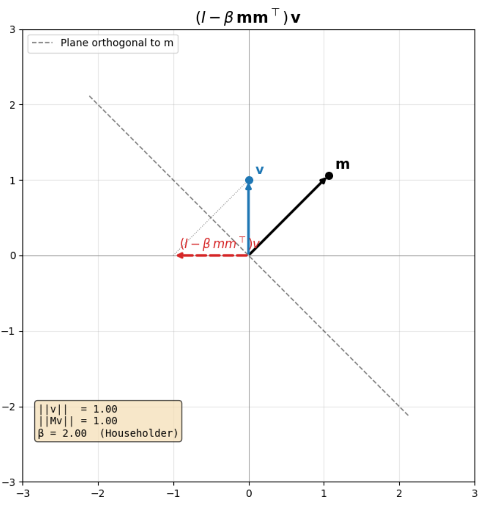
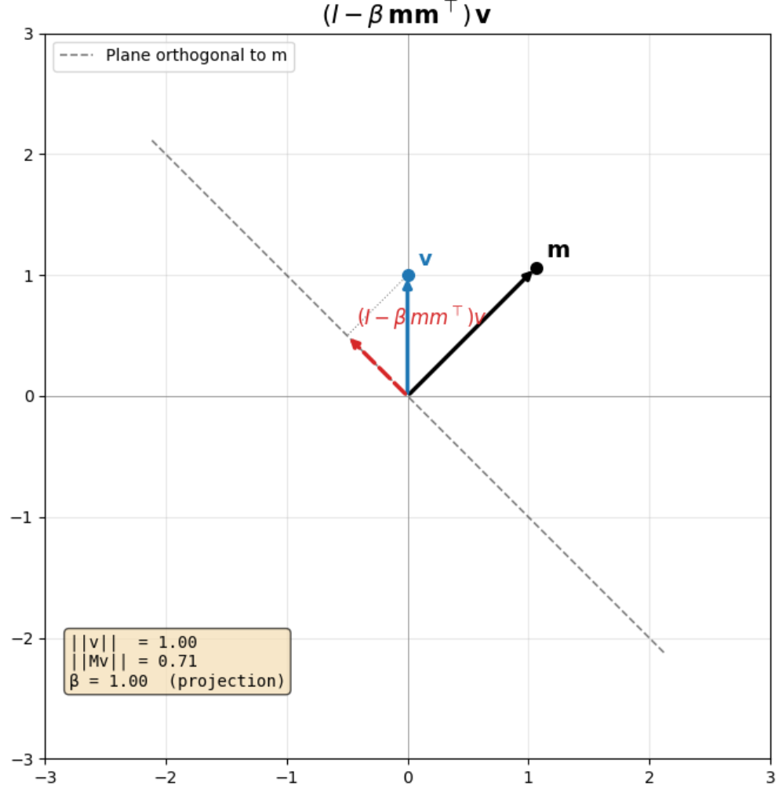

# Gated Delta Net Attention: A Deep Dive into the Linear Attention Mechanism Powering Qwen3.5

The recently released [Olmo Hybrid](https://allenai.org/blog/olmohybrid), Qwen3.5, Nemotron-3-Super and GLM-5 [models](https://sebastianraschka.com/llm-architecture-gallery/#card-minimax-m2-5-230b) are all hybrid attention models, with interleaved linear/sparse and dense/self attention layers.

While standalone linear attention models don't perform as well as dense attention models on recall oriented tasks,
interspersing the two (often referred to as hybrid attention) bridges the gap, and allows for much more efficient inference.

Linear attention solves 2 key problems associated with dense attention:

1. **Growing KV-cache**: In dense attention, the key-value cache grows linearly with the sequence length, couple this with the fact that we need to save the KV-cache for each layer, it's easy to see how we can quickly run out of memory on long sequence tasks. Self-attention is also a memory bound operation (at inference time) on the GPU because of the need to transfer the KV-cache from HBM to SRAM memory, and back again. Linear attention on the other hand has a fixed memory footprint, and can be computed on the fly without needing to save the KV-cache.
2. **Quadratic compute**: Dense attention has a quadratic compute complexity with respect to the sequence length, whereas linear attention has a linear compute complexity.

Further, the Olmo team [highlight](https://allenai.org/blog/olmohybrid) that hybrid models are more expressive than linear only or dense only models. In the build-up to training the Olmo 3 Hybrid model, they found that hybrid models were:

1. More token efficient.
2. Performed better on a wide range of benchmarking datasets across domains.

> hybrid models are more expressive than transformers, and this translates to more efficient scaling when they are pretrained in practice. Theoretically, hybrid models can represent useful computations that neither pure transformers nor pure linear RNNs can easily express alone. Moreover, we argue theoretically that this expressivity advantage likely explains the better pretraining scaling we find in practice.

The outsized inference time benefits, improved expressivity, and the growing number of mainstream model providers adopting it, makes it seem like this is going to be one of those architectural paradigms like MoE, GQA etc. that will likely stick around for a while, making it a worthwhile topic to understand deeply.


While there are countless blogs on the workings of dense attention, I didn't find many that explained the Gated Delta Net Attention mechanism used in models like **Qwen3-Next, Qwen3.5, Kimi Linear, Olmo Hybrid** with the same level of detail, so I decided to write one myself.

This blog will help you understand the intuition behind linear attention, what Gated Delta Net Attention is, the math that underpins it, some of the geometric interpretations and pytorch code to implement it from scratch.


## From Dense to Linear Attention
The intuition behind linear attention is explained brilliantly in the [Smol Training Playbook](https://huggingface.co/spaces/HuggingFaceTB/smol-training-playbook#excursion-hybrid-models) and I'm just going to paraphrase them here.

Attention at its core is the interaction between the Q, K and V matrices. If we simplify the formula and get rid of the softmax and scaling factor, we can write the output of attention at time step t as:

$$\mathbf{o}_t = \sum_{j=1}^{t} (q_t^\top k_j) \, v_j$$

Since matrix multiplication is associative, we can rewrite the above equation as:

$$\sum_{j=1}^{t} (q_t^\top k_j) \, v_j = \left( \sum_{j=1}^{t} v_j k_j^\top \right) q_t$$

The original representation of attention requires us to save the K and V matrices for all previous time steps, leading to a growing KV-cache. 

However, with the reformulated version we can have a matrix called the **State** matrix that's updated at each time step to store the running sum of the outer product of K and V, which has a fixed size of $d_v \times d_k$ (head dimension size of key and value) regardless of the sequence length:

$$S_t \triangleq \sum_{j=1}^{t} v_j k_j^\top = V_{1:t}^\top K_{1:t} \in \mathbb{R}^{d_v \times d_k}$$

At each time step, we can update the state matrix by adding the outer product of the current value and key:

$$S_t = S_{t-1} + v_t k_t^\top$$

This simple re-formulation is what lies at the heart of most linear attention operations.

## Gated Delta Net Attention

Gated Delta Net was first introduced by folks at MIT and NVIDIA in [Gated Delta Networks: Improving Mamba 2 with Delta Rule](https://arxiv.org/pdf/2412.06464).

It's composed of 2 components:

1. A gate/decay factor represented by **$\alpha$** that allows a model to _forget_ old information in the state matrix.
2. A delta update rule that dynamically erases the value ($v^{\text{old}}_t$)
associated with the current input key ($k_t$) and writes a new value ($v^{\text{new}}_t$) to the state matrix. The delta rule introduces a new parameter **$\beta$** that controls the strength of the delta update.

### Decay Factor

The decay factor is a straightforward scalar that's applied at each time step of the state matrix. The new state matrix is computed as:

$$S_t = \alpha S_{t-1} + v_t k_t^\top$$

The range of $\alpha$ is between 0 and 1, where $\alpha = 0$ means that the state matrix is completely reset at each time step (i.e., no information is retained from previous time steps). Low alpha values help the model forget old information faster, which can be beneficial for tasks that require more focus on recent inputs.

### Delta Update Rule

The goal of the delta update rules is to erase the old value associated with the current input key ($k_t$) and write a new value to the state matrix.

To understand this better we need to find a way to retrieve the old value $v^{\text{old}}_t$ associated with a key from the state matrix.

In practice the State matrix is of shape $d_v \times d_k$, where $d_v$ is the dimension of the value vector and $d_k$ is the dimension of the key vector. Since we want to retrieve a value vector of dimension $d_v$ from the state matrix, we can do this by multiplying the state matrix with the key vector:

$$v^{\text{old}}_t = S_{t-1} k_t$$

#### Does $S_{t-1} k_t$ really retrieve the old value associated with the key $k_t$?

Let's expand $S_{t-1} k_t$ by substituting the definition of the state matrix:

$$S_{t-1} k_t = \left( \sum_{j=1}^{t-1} v_j k_j^\top \right) k_t = \sum_{j=1}^{t-1} (k_j^\top k_t) \, v_j$$

This is a **weighted sum of all previously stored values**, where the weight on each $v_j$ is the dot product $k_j^\top k_t$ — i.e., **how similar the current key is to each past key**.

Suppose at some earlier time step $i < t$, the value $v_i$ was written with a key $k_i$ that equals $k_t$. If the keys are orthonormal ($k_j^\top k_i = 1$ when $j = i$, and $0$ otherwise), then all the cross-terms vanish:

$$S_{t-1} k_t = \sum_{j=1}^{t-1} (k_j^\top k_t) \, v_j = 1 \cdot v_i + 0 = v_i$$

and we get **exact retrieval** of the value that was previously associated with that key.

In practice keys are not perfectly orthogonal, so the retrieval is approximate — you get the target value plus some interference from other stored key-value pairs. This is why the code normalizes $K$ (line 293 in the implementation below): keys closer to unit norm and more spread apart give cleaner retrieval.

#### Formulating the Delta Update Rule

The delta update rule partially erases the old value by subtracting a scaled version of it from the state matrix and then adds a scaled version of the new value.

Erasing the old value:

$$S_{t_\text{erased}} = S_{t-1} - \beta S_{t-1} k_t k_t^\top$$

> $v^{\text{old}}_t$ is of shape $d_v$ and to obtain a matrix of shape $d_v \times d_k$ matching the shape of the state matrix, we can take the outer product of $v^{\text{old}}_t$ with the key vector $k_t$

Writing the new value:

$$S_t = S_{t_\text{erased}} + \beta v^{\text{new}}_t k_t^\top$$

Putting it all together:
$$S_t = S_{t-1} - \beta S_{t-1} k_t k_t^\top + \beta v^{\text{new}}_t k_t^\top$$

$$S_t = S_{t-1} + \beta (v^{\text{new}}_t - v^{\text{old}}_t) k_t^\top$$

or equivalently:
$$S_t = S_{t-1}(I - \beta k_t k_t^\top) + \beta v^{\text{new}}_t k_t^\top$$

where $I$ is the identity matrix.

### Geometric Interpretation and Householder Matrices

Householder matrices are a type of orthogonal matrix that can be used to perform reflections in a high-dimensional space. They are defined as:

$$H = I - 2 \frac{mm^\top}{m^\top m}$$

where $m$ is a non-zero vector and $I$ is the identity matrix.

When the norm of m is 1, the Householder matrix can be simplified to:
$$H = I - 2 mm^\top$$

Notice how similar this is to the term $(I - \beta k_t k_t^\top)$ in our delta update rule. In fact, when $\beta = 2$ and $k_t$ is a unit vector, the term becomes a Householder matrix that reflects across the plane orthogonal to $k_t$.

To understand what householder matrices do let's take a simple example of a 2D space and plot the effect of a householder matrix when it is multiplied with a vector. I'd recommend running the code below in a Jupyter notebook to get an interactive visualization of how varying $\beta$ and the angle of $m$ affects the transformation. You can also use the notebook linked [here]().

```python
%matplotlib inline
import numpy as np
import matplotlib.pyplot as plt
from ipywidgets import interact, FloatSlider
import warnings
warnings.filterwarnings("ignore", category=UserWarning)

def draw_scene(ax, m_angle, v_x, v_y, beta):
    """Draw the full Householder scene on a given axes."""
    m = np.array([np.cos(np.radians(m_angle)), np.sin(np.radians(m_angle))])
    v = np.array([v_x, v_y])
    M = np.eye(2) - beta * np.outer(m, m)
    Mv = M @ v

    # Reflection plane
    perp = np.array([-m[1], m[0]])
    t = np.linspace(-3, 3, 200)
    ax.plot(perp[0]*t, perp[1]*t, "k--", lw=1.2, alpha=0.5, label="Plane orthogonal to m")

    # m vector
    ax.annotate("", xy=(m[0]*1.5, m[1]*1.5), xytext=(0, 0),
                arrowprops=dict(arrowstyle="-|>", color="black", lw=2.5))
    ax.plot(m[0]*1.5, m[1]*1.5, "ko", ms=7, zorder=5)
    ax.text(m[0]*1.55+0.05, m[1]*1.55+0.05, r"$\mathbf{m}$", fontsize=14, fontweight="bold")

    # v vector
    ax.annotate("", xy=(v[0], v[1]), xytext=(0, 0),
                arrowprops=dict(arrowstyle="-|>", color="tab:blue", lw=2.5))
    ax.plot(v[0], v[1], "o", color="tab:blue", ms=7, zorder=5)
    ax.text(v[0]+0.08, v[1]+0.08, r"$\mathbf{v}$", fontsize=13, color="tab:blue")

    # Transformed vector
    ax.annotate("", xy=(Mv[0], Mv[1]), xytext=(0, 0),
                arrowprops=dict(arrowstyle="-|>", color="tab:red", lw=2.5, linestyle="--"))
    ax.text(Mv[0]+0.08, Mv[1]+0.08, r"$(I - \beta\, mm^\top)v$", fontsize=12, color="tab:red")

    # Connecting line
    ax.plot([v[0], Mv[0]], [v[1], Mv[1]], ":", color="grey", lw=0.8)

    # Info box
    beta_label = ""
    if abs(beta) < 0.01: beta_label = "  (identity)"
    elif abs(beta - 1.0) < 0.01: beta_label = "  (projection)"
    elif abs(beta - 2.0) < 0.01: beta_label = "  (Householder)"
    info = (f"||v||  = {np.linalg.norm(v):.2f}\n"
            f"||Mv|| = {np.linalg.norm(Mv):.2f}\n"
            f"\u03b2 = {beta:.2f}{beta_label}")
    ax.text(-2.8, -2.4, info, fontsize=10, family="monospace",
            bbox=dict(boxstyle="round", facecolor="wheat", alpha=0.7))

    ax.set_xlim(-3, 3); ax.set_ylim(-3, 3)
    ax.set_aspect("equal")
    ax.grid(True, alpha=0.3)
    ax.axhline(0, color="grey", lw=0.5); ax.axvline(0, color="grey", lw=0.5)
    ax.set_title(r"$(I - \beta\, \mathbf{m}\mathbf{m}^\top)\, \mathbf{v}$", fontsize=15)
    ax.legend(loc="upper left", fontsize=10)

def update_householder(m_angle=45, v_x=1.5, v_y=0.5, beta=2.0):
    plt.close("all")
    fig, ax = plt.subplots(figsize=(7, 7))
    draw_scene(ax, m_angle, v_x, v_y, beta)
    plt.tight_layout()
    plt.show()

interact(
    update_householder,
    m_angle=FloatSlider(value=45, min=0, max=360, step=1, description="m angle (\u00b0)"),
    v_x=FloatSlider(value=1.5, min=-2.5, max=2.5, step=0.1, description="v_x"),
    v_y=FloatSlider(value=0.5, min=-2.5, max=2.5, step=0.1, description="v_y"),
    beta=FloatSlider(value=2.0, min=0.0, max=2.0, step=0.01, description="\u03b2"),
);
```

#### $\beta$ = 2, Householder Transformation



In the plot above we have an input vector $v$ along the y-axis and a vector $m$ at a 45 degree angle. The dashed line represents the plane orthogonal to $m$. The red dashed vector is the result of multiplying $v$ with the matrix $(I - \beta mm^\top)$

When $\beta = 2$, we have a pure Householder transformation. $v$ is reflected across the plane orthogonal to the vector $m$. So if $v = (0,1)$ initially, after the transformation it becomes $v' = (-1,0)$.

#### $\beta$ = 1, Projection Transformation



When $\beta = 1$, we have a projection transformation. In this case, the vector gets projected onto the plane orthogonal to $m$.

When $\beta = 0$, we have an identity transformation.

### Mapping to Gated Delta Net

When two vectors are orthogonal their cosine similarity is 0, since $\beta$ = 1  projects our input vector onto the orthogonal plane of our reflection vector it means that **when $m = k_t$ and $\beta = 1$, the old value is completely erased from the state matrix.**

When $\beta = 0$, the old value is completely retained.

So by varying $\beta$ the model can control how much of the old value to erase.

### Combining Decay and Delta Update

By combining the decay and delta update rules, we can write the full Gated Delta Net update as:

$$S_t = \alpha S_{t-1} + \beta (v^{\text{new}}_t - v^{\text{old}}_t) k_t^\top$$

Or equivalently, using the expanded form from the delta rule section:

$$S_t = \alpha S_{t-1}(I - \beta k_t k_t^\top) + \beta v^{\text{new}}_t k_t^\top$$

Written this way, the connection to the Householder discussion is clear: at each time step, the state matrix is first decayed by $\alpha$, then the term $(I - \beta k_t k_t^\top)$ acts as a generalized Householder transformation on the rows of the state, partially erasing the component along $k_t$ before the new value is written.

### Final Output Calculation

Going back to the very first equation we had for the output of attention:

$$\mathbf{o}_t = \left( \sum_{j=1}^{t} v_j k_j^\top \right) q_t$$

We can rewrite this using the state matrix as:
$$\mathbf{o}_t = S_t q_t$$

## PyTorch Implementation

In practice we have decay and beta factors for each attention head and time step, allowing head specialization and dynamic control over the update rule.

We now have all the info required to implement Gated Delta Net Attention in PyTorch.

```python
import torch
import torch.nn as nn
import torch.nn.functional as F

class GatedDeltaNetAttention(nn.Module):
    def __init__(self, d_k: int, d_v: int, n_heads: int):
        """Gated Delta Net Attention mechanism.
        
        Args:
            d_k: Dimension of the key vectors.
            d_v: Dimension of the value vectors.
            n_heads: Number of attention heads.
        """

        super().__init__()
        self.d_k = d_k
        self.d_v = d_v
        self.n_heads = n_heads
        
        # Linear projections for Q, K, V
        self.q_proj = nn.Linear(d_k, d_k)
        self.k_proj = nn.Linear(d_k, d_k)
        self.v_proj = nn.Linear(d_k, d_v)
        
        # Decay and beta parameters for each head
        self.alpha = nn.Linear(d_k, n_heads)
        self.beta = nn.Linear(d_k, n_heads)

    def forward(self, x) -> tuple[torch.Tensor, torch.Tensor]:
        """Compute Gated Delta Net Attention.

        Args:
            x: Input tensor of shape (batch_size, seq_len, d_k)
        Returns:
            output: Tensor of shape (batch_size, seq_len, d_v)
            state: Final state matrix of shape (batch_size, n_heads, d_v, d_k)
        """
        batch_size, seq_len, _ = x.size()
        qk_head_dim = self.d_k // self.n_heads
        v_head_dim = self.d_v // self.n_heads

        # Project inputs to Q, K, V
        Q = self.q_proj(x).view(batch_size, seq_len, self.n_heads, qk_head_dim)  # (batch_size, seq_len, n_heads, qk_head_dim)
        K = self.k_proj(x).view(batch_size, seq_len, self.n_heads, qk_head_dim)  # (batch_size, seq_len, n_heads, qk_head_dim)

        # normalize K for better retrieval of old values
        K = F.normalize(K, p=2, dim=-1)
        V = self.v_proj(x).view(batch_size, seq_len, self.n_heads, v_head_dim)  # (batch_size, seq_len, n_heads, v_head_dim)


        alphas = torch.sigmoid(self.alpha(x))  # (batch_size, seq_len, n_heads)
        betas = torch.sigmoid(self.beta(x))    # (batch_size, seq_len, n_heads)

        # Initialize state matrix for each head
        S = torch.zeros(batch_size, self.n_heads, v_head_dim, qk_head_dim, device=x.device)

        outputs = []
        for t in range(seq_len):
            q_t = Q[:, t, :]  # (batch_size, n_heads, qk_head_dim)
            k_t = K[:, t, :]  # (batch_size, n_heads, qk_head_dim)
            v_t = V[:, t, :]  # (batch_size, n_heads, v_head_dim)

            # Compute old value retrieval
            v_old_t = torch.einsum('bhvk,bhk->bhv', S, k_t)  # (batch_size, n_heads, d_v)

            diff = v_t - v_old_t  # (batch_size, n_heads, d_v)
            delta_update = betas[:, t].unsqueeze(-1) * diff  # (batch_size, n_heads, d_v)
            decay_update = alphas[:, t].unsqueeze(-1).unsqueeze(-1) * S  # (batch_size, n_heads, d_v, d_k)

            # Update state matrix
            S = decay_update + torch.einsum('bhv,bhk->bhvk', delta_update, k_t)  # (batch_size, n_heads, d_v, d_k)

            output = torch.einsum('bhvk,bhk->bhv', S, q_t)  # (batch_size, n_heads, d_v)
            outputs.append(output)

        return torch.stack(outputs, dim=1).view(batch_size, seq_len, self.d_v), S  # (batch_size, seq_len, d_v), (batch_size, n_heads, d_v, d_k)
```

### Deficiencies

One of the main advantages of self/dense attention is that it can be parallelized across the sequence dimension, which lets us make the most of a GPU's compute capacity during training.

The above implementation of Gated Delta Net lacks this property and consequently isn't used in production grade training pipelines. In practice the same set of equations can be reformulated to process chunks of the sequence in parallel. This is referred to as the **Chunkwise parallel form**.

The math for the chunkwise parallel form is a bit more involved and I might write a follow-up blog to explain it in detail or you could go through the paper if you're eager to learn!. 

If you're interested in going through some of the official implementations I've linked them in the references below.

### References
* [LLM Architecture Gallery](https://sebastianraschka.com/llm-architecture-gallery/#card-minimax-m2-5-230b)
* [A Systematic Analysis of Hybrid Linear Attention](https://arxiv.org/pdf/2507.06457)
* [Official Implementation of Gated Delta Net](https://github.com/NVlabs/GatedDeltaNet/tree/main)
* [Reference for Implementation](https://github.com/NVlabs/GatedDeltaNet/blob/main/lit_gpt/gated_delta_net.py)
* [Sebastian Raschka's Implementation of Gated Delta Net](https://github.com/rasbt/LLMs-from-scratch/blob/main/ch04/08_deltanet/README.md)
* [Flash Linear Attention libs implementation](https://github.com/fla-org/flash-linear-attention/tree/main/fla/ops/gated_delta_rule)